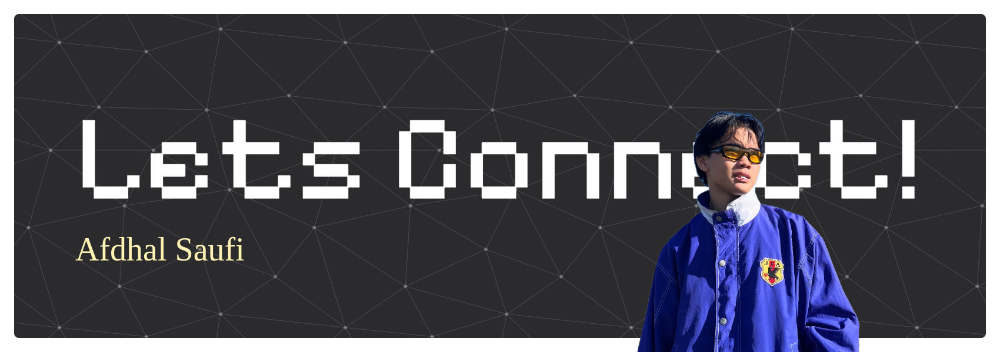

## Hey there, lets connect!

I am Afdhal Saufi, an aspiring cybersecurity analyst. Current hobby is to study CS across all fields. Feel free to check out my website!

1. [fdhlsfi.site](https://fdhlsfi.site) -- personal website, this is where I talk about myself
2. [fdhlsfi.tech](https://fdhlsfi.tech) -- tech-centered, mostly devlogs and notes

# 💫 About Me:
🔭 I’m currently working on 👯 I’m looking to collaborate on 🤝 I’m looking for help with 🌱 I’m currently learning 💬 Ask me about ⚡ Fun fact

## 🌐 Socials:
  

# 💻 Tech Stack:
       
# 📊 GitHub Stats:
 
 

## 🏆 GitHub Trophies

### ✍️ Random Dev Quote

### 🔝 Top Contributed Repo

---

<!-- Proudly created with GPRM ( https://gprm.itsvg.in ) -->
<!--
**ezxd1148/ezxd1148** is a ✨ _special_ ✨ repository because its `README.md` (this file) appears on your GitHub profile.

Here are some ideas to get you started:

- 🔭 I’m currently working on ...
- 🌱 I’m currently learning ...
- 👯 I’m looking to collaborate on ...
- 🤔 I’m looking for help with ...
- 💬 Ask me about ...
- 📫 How to reach me: ...
- 😄 Pronouns: ...
- ⚡ Fun fact: ...
-->
