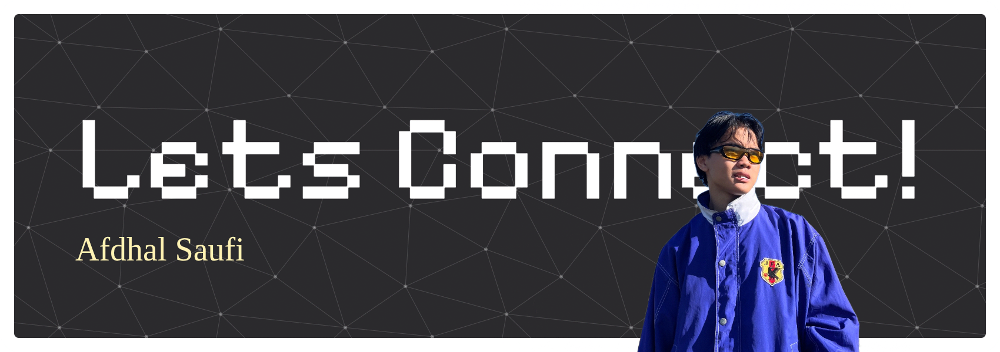

# Afdhal Saufi

**Systems · Infrastructure · Security · Applied ML**

I build software around systems, infrastructure, and security, mostly on Linux, usually in Python, TypeScript, or C, and in Zig or Nim when I want to get closer to the metal.

**Currently:** 18, computer science at Universiti Kebangsaan Malaysia. CTO of HackDev Malaysia. Technical co-founder at TechWira.

---

## What I work on

I like understanding how a system behaves underneath the abstractions I normally use, then building on that understanding. Most of my work falls into these areas:

- **Systems and infrastructure** — custom Linux distributions, network services, deployment on AWS and Cloudflare
- **Security engineering** — scanning and triage tooling, tamper-evident forensic logging, live attack simulation
- **Applied ML** — retail intelligence and fine-tuned models, mostly in Python
- **Community and competition** — CTF write-ups, competition submissions, running a student security community

## Featured work

### Security

**[live-attack-simulation](https://github.com/ezxd1148/live-attack-simulation)** · `TypeScript` · `AWS`
Live red-team vs blue-team demo built for AWS Community Day under HackDev Malaysia: a deliberately vulnerable SolidStart app on EC2, exploited while the audience watches whether a custom detection layer and CloudWatch notice.
*Technically interesting:* the whole attack → detection → log → webhook → SSE → dashboard path, in a deliberately isolated account. Runtime verification was still pending at the last push — `docs/security-model.md` and `docs/teardown.md` cover the blast radius.

**[Sentinel](https://github.com/ezxd1148/Sentinel)** · `Nim` `Solidity` `Polkadot`
Security agent that anchors forensic log fingerprints to a smart contract, so evidence survives an attacker who already has root. Built for the Polkadot Solidity Hackathon 2026.
*Technically interesting:* real-time capture and encryption in a Nim engine compiled to C, with the resulting hash anchored on-chain and evidence pushed to decentralized storage.

**[exakBot](https://github.com/ezxd1148/exakBot)** · `Python`
Telegram bot that triages suspicious links and returns a risk level, the reasons behind the score, and safe next steps.
*Technically interesting:* SSRF-safe redirect resolution under strict timeouts, and scoring that is explainable rather than a black box.

**[Lightning](https://github.com/ezxd1148/Lightning)** · `Nim`
Multithreaded, high-speed port scanner.
*Technically interesting:* concurrency and raw socket work in a systems language — the same ground covered more simply in [Tinjau](https://github.com/ezxd1148/Tinjau).

### Systems

**[EVA-Distro](https://github.com/ezxd1148/EVA-Distro)** · `Shell` · `Arch Linux` · `Raspberry Pi 5`
An Arch-based Linux distribution I'm building for the Raspberry Pi 5, assembled with `mkarchiso` and documented as I go.
*Technically interesting:* a real image pipeline, bootable ARM system, custom build profile, and the maintenance that follows a custom OS instead of a packaged one.

**[memory_allocator](https://github.com/ezxd1148/memory_allocator)** · `Zig`
A bump allocator written in Zig to study allocation internals.
*Technically interesting:* memory management from scratch, which is the fastest way to find out what a runtime is quietly doing for you.

**[zig-http](https://github.com/ezxd1148/zig-http)** · `Zig`
A small HTTP server in Zig.
*Technically interesting:* sockets, request parsing, and serving without a framework to hide the details.

### Applied ML

<!-- If DataSentinel is the TechWira product, say so here and link the company. -->
**[DataSentinel](https://github.com/ezxd1148/DataSentinel)** · `Python`
AI-powered retail intelligence for Malaysian e-commerce sellers on Shopify, WooCommerce, Shopee, and Lazada — predictive analysis delivered as plain-English insight.
*Technically interesting:* turning messy commerce data into decisions a small business can act on without hiring a data team.

**[zig-model](https://github.com/ezxd1148/zig-model)** · `Python`
A language model fine-tuned specifically for Zig, trained on AMD Instinct MI300X as part of the AMD Developer Hackathon, with iqramdanish.
*Technically interesting:* fine-tuning end to end, and a direct test of whether a narrow specialist model beats a general one on a single language.

### Community and competition

**[CTF-writeups](https://github.com/ezxd1148/CTF-writeups)** · `Python`
Write-ups from the CTFs I've competed in. Competition and paper work lives in [Competitions](https://github.com/ezxd1148/Competitions) and [research_paper](https://github.com/ezxd1148/research_paper).

## Tools I reach for

- **Core** — `Python` · `TypeScript` · `Shell`. What I ship and maintain.
- **Systems and security** — `C` · `Nim` · `Zig` · `Solidity`. Scanners, allocators, servers, contracts.
- **Cloud and infrastructure** — `AWS` · `Cloudflare`
- **Learning now** — `Zig` and `Nim` properly: allocators, HTTP servers, and how memory and compilation actually work
- **Occasionally** — `Ruby` · `GDScript` (Godot) · `LaTeX`

## Highlights

- **CTO, HackDev Malaysia**: student-led cybersecurity community, 1,800+ members
- **Technical co-founder, TechWira**: retail intelligence and ML
- Represented Malaysia at international STEM and computer science competitions
- 3 international technology competition wins before turning 18

## Elsewhere

- [fdhlsfi.site](https://fdhlsfi.site) — portfolio, projects, background, and experience
- [fdhlsfi.tech](https://fdhlsfi.tech) — technical writing, notes, experiments, and devlogs

## Contact

Open to software engineering internships, security engineering roles, and collaboration on open-source security tooling.

## GitHub activity

